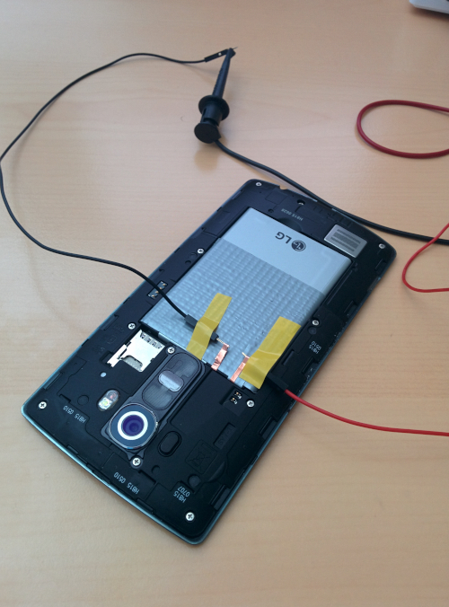

# Inria measurements on third-party libraries

This repository regroups all work put into completing the TPL energy consumption study of ***Saborido et al.*** by the 
SPIRALS team at Inria Lille, France.

### Tools

To furnish power to our test smartphone, we use a [Monsoon LVPM hardware](https://www.msoon.com/powermonitor-support)
with an output voltage of 4V.

We use a modified LG G4 (H815) smartphone for our experiments. Its battery is still in place, but is shorted out; we 
don't want it to furnish power to the device, not to distort our results. The positive pin is blocked, and both negative 
and positive pins are linked to our LVPM. The phone is still connected to the computer by USB, but we use an application 
to disable USB charge for the same previously mentioned reasons.

## Scripts 

We use several scripts to establish measures:
* **measurements.py** is used to give power to the smartphone, launch scenarios with minimal apps and gather results, 
exporting them as CSV files;
* **plot.py** exploits previously-created CSV files to create graphs;
* **analyse.py** uses these files to compute metrics such as mean consumption, min/max values etc.

## Method

We run each scenario a given number of times, and run a script between each run to kill previously-used application to
provide the same environment for each run.
